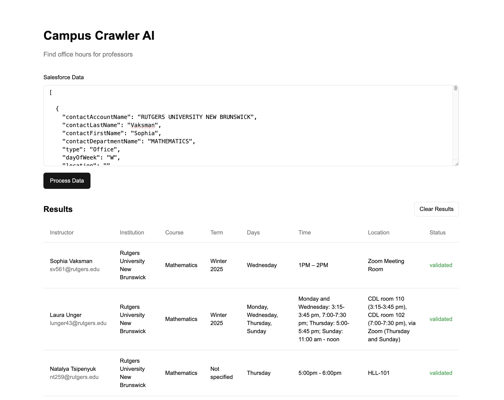

# Office Hours Automation Tool (OHAT)

An AI-powered tool that automates the retrieval of instructor office hours from the web, streamlining sales rep research and saving time.



## Getting Started

### Credentials

Create a `.env` file in the root directory and add the following credentials:

```sh
PERPLEXITY_API_KEY=your_perplexity_api_key
OPENAI_API_KEY=your_openai_api_key
SERPAPI_API_KEY=your_serpapi_api_key
GOOGLE_API_KEY=your_google_api_key
```

### Volta

We use [Volta](https://volta.sh/) to manage our Node.js version.  It's not required, but it's recommended.

```sh
curl https://get.volta.sh | bash
```

### Installation

`npm install`

`npm run dev`

### Usage

Visit `http://localhost:3000` to access the application.

Copy the data from [the seed file](app/api/seed/faculty_schedule.json) and paste it into the `Salesforce Data` input field.

Click `Submit` to see the results.
